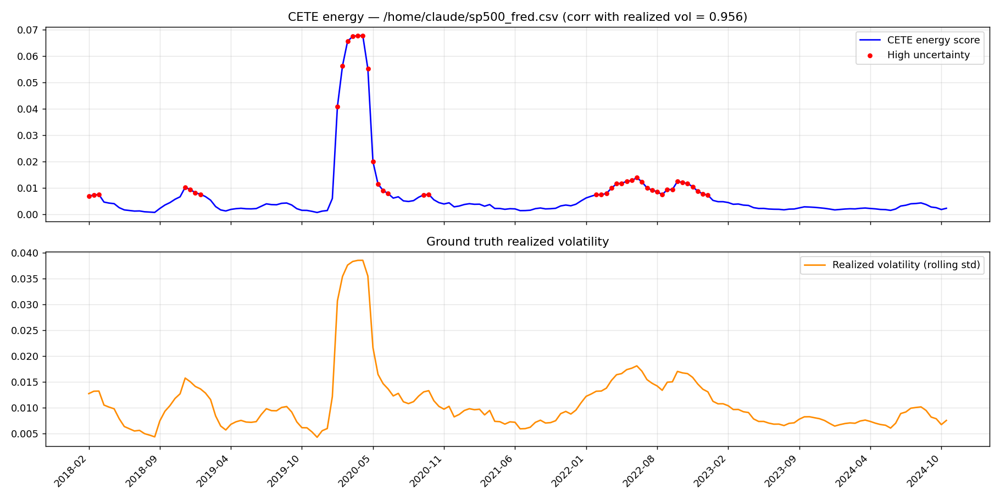
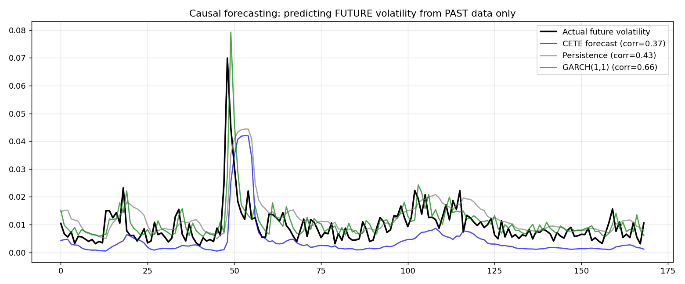

# CETE — Chrono-Entropic Topodynamic Engine

A spectral-entropy volatility score for daily return series, debugged,
benchmarked against real baselines, and honestly re-scoped based on what
the evidence actually showed — including admitting where the original
algorithm doesn't add value.

**The honest summary: the engine reduces to `np.var`. The one measured
property is a high-precision screen for future extreme-move blocks. The
bug-fix log is the contribution.**

## Headline results

| Question | Finding |
|---|---|
| Did the original algorithm even work? | No — correlation with real realized volatility was **-0.24** (wrong sign) |
| After fixing two bugs? | **0.956** |
| Is 0.956 actually impressive? | No — near-tautological (Parseval). CETE's score correlates **0.9996** with plain `np.var(window)` over 1,695 windows |
| Can it forecast *future* volatility (the deployable test)? | No — loses to naive persistence (0.374 vs 0.429), loses clearly to GARCH(1,1) (0.660) |
| Does entropy weighting help transition detection? | No — identical precision, recall, and firing count to plain variance |
| Is it good for anything, then? | **Yes** — as a crisis-window flag it reaches **precision 1.000, recall 0.422** against future top-5% move blocks, evaluated causally |
| Final state | Score reduced to entropy-weighted spectral power; relaxation dynamics removed; data layer hardened; evaluation harness retained |

Full debugging and evaluation narrative in [`docs/RESULTS.md`](docs/RESULTS.md).




## What it does

CETE takes a window of daily returns and computes:

```
energy = 0.5 * mean(|FFT_entropy_weighted(x_centered)|²)
```

By Parseval's theorem, this is proportional to `np.var(x_centered)`. The
entropy weighting is a near-constant rescale of the spectrum. Over
1,695 windows of real S&P 500 data, CETE's score and plain rolling
variance correlate at **Pearson 0.9996, Spearman 0.9996**.

An earlier version had a hand-designed dynamical system on top
(momentum, per-dimension metric, four-operator blend, 20 relaxation
steps). It was removed after three independent lines of evidence:

1. It contributed only a bounded ±10% modulation to the reported score.
2. Measured causally, CETE scored 0.374 vs persistence 0.429 and GARCH
   0.660 — worse than the simplest baseline.
3. Traced directly, a 10× input std ratio was compressed to **3.99×**
   by the dynamics. The first "fix" anchored the reported score to
   pre-dynamics power, which made the number correct without fixing
   the defect. A later test caught the compression still present, and
   the dynamics were removed entirely.

This repo:

1. Documents the two real bugs in `src/cete.py`'s docstring.
2. Benchmarks the fixed score against plain variance and GARCH(1,1),
   retrospectively and causally (`scripts/baseline_comparison.py`,
   `scripts/causal_evaluation.py`).
3. Tests whether entropy weighting helps transition detection at all
   (`scripts/transition_evaluation.py`).
4. Keeps the one measured property — a percentile screen for future
   extreme-move blocks — as the deployable output.

## Why this repo is structured this way

The original implementation looked physically motivated and produced
plausible numbers, but scored real market data *backwards* — calm periods
came out "high energy", the 2020 COVID crash came out unremarkable.
Fixing the bugs got the score correlating at 0.956 with realized
volatility. The natural next question — "is that actually good, or just
measuring something trivial?" — turned out to matter: it is
mathematically close to a one-line variance calculation, and when tested
the only way that counts for deployment (forecasting *unseen* future
volatility from *past* data only), it loses to the simplest possible
baseline.

Rather than stop at the flattering retrospective number, this repo
follows the evidence to where CETE's one genuinely useful property lives
(a conservative, high-precision anomaly flag) and reports that. The
bug-fix log — particularly the Bug 2 workaround that made the reported
number right while leaving the defect in place, caught months later by a
test that measured the mechanism the workaround had bypassed — is itself
part of the contribution.

## Running this live

Everything above runs on historical data for one-off analysis or
backtest. To monitor an asset going forward, use
`scripts/live_monitor.py` — the entrypoint meant to be scheduled.

**One-off check, right now:**

```bash
pip install -r requirements.txt
python scripts/live_monitor.py --ticker ^GSPC
```

This fetches the last ~3 years of data, runs CETE's screen on the most
recent window, reuses a cached GARCH fit if it's less than 5 days old
(refits otherwise), and prints a decision.

**Exit codes** (deliberately not "flagged == error"):

- `0` — ran successfully, whether the screen was quiet or flagged. A
  positive signal is not a process failure. The flag is in the JSON
  output and stdout.
- `2` — data fetch failed (yfinance and the Stooq fallback both down).
  No forecast produced.
- `3` — GARCH fit failed or state cache is corrupt.

**Scheduling it daily** (Linux/macOS, after US market close, 5pm ET):

```bash
crontab -e
# add:
0 17 * * 1-5 cd /path/to/cete-regime-detector && /usr/bin/python3 scripts/live_monitor.py --ticker ^GSPC --out latest_result.json >> monitor.log 2>&1
```

**Windows:** create a Basic Task in Task Scheduler that runs
`python scripts\live_monitor.py --ticker ^GSPC --out latest_result.json`
on a weekday trigger after market close.

**Wiring up an alert:** `--out result.json` writes a small JSON payload
(`cete_flagged`, `garch_vol_forecast`, `decision`). Wire it to whatever
you actually use:

```bash
python scripts/live_monitor.py --ticker ^GSPC --out result.json
# Read result.json and alert on cete_flagged == true
```

**Refit cadence:** `--refit-every-days` (default 5) controls how often
the expensive GARCH fit reruns; the cached fit lives in `.cete_state/`
(gitignored). CETE's screen has no fitting step and always runs fresh.

## Project structure

```
cete-regime-detector/
├── src/
│   ├── cete.py               # Score: entropy-weighted FFT spectral power
│   ├── data.py               # Versioned, validated, cached data layer
│   ├── regime.py             # Scoring, evaluation, operating curves
│   ├── garch_filter.py       # Recursive GARCH state update between refits
│   └── metrics.py            # Shared correlation and error metrics
├── scripts/
│   ├── run_analysis.py              # Basic pipeline: fetch -> score -> plot
│   ├── baseline_comparison.py       # CETE vs GARCH vs variance (retrospective)
│   ├── causal_evaluation.py         # Leakage-free forecasting + screening
│   ├── transition_evaluation.py     # Changepoint detection comparison
│   └── live_monitor.py              # Scheduled entrypoint
├── tests/
│   ├── test_data.py          # Data layer: caching, validation, fallback
│   └── test_cete.py          # Engine, scoring, leakage guards
├── docs/
│   └── RESULTS.md            # Full validation writeup, all numbers, all plots
├── outputs/                  # Created on first run (gitignored)
└── requirements.txt
```

## Setup

```bash
python -m venv .venv
source .venv/bin/activate         # Windows: .venv\Scripts\activate
pip install -r requirements.txt
```

## Usage

Basic pipeline against live data (default: S&P 500, 2018–2024):

```bash
python scripts/run_analysis.py
```

Any other ticker, or a local CSV (`date,value` columns):

```bash
python scripts/run_analysis.py --ticker AAPL --start 2020-01-01 --end 2024-12-31
python scripts/run_analysis.py --csv path/to/prices.csv
```

Baseline comparison (retrospective — CETE vs GARCH vs plain variance):

```bash
python scripts/baseline_comparison.py --ticker ^GSPC
```

The evaluation that actually determines deployability — causal
forecasting test plus crisis-flag precision/recall:

```bash
python scripts/causal_evaluation.py --ticker ^GSPC
```

Transition-detection comparison — does entropy weighting help find
volatility changepoints?

```bash
python scripts/transition_evaluation.py --ticker ^GSPC
```

## Testing

```bash
pytest tests/ -v                       # offline tests (default)
pytest tests/ -v -m network            # include live-fetch tests
```

`pytest.ini` registers the `network` marker and deselects those tests
by default, so the offline suite is deterministic.

**What the tests pin down.** `test_data.py` (24 tests) covers ticker
normalization, price validation, cache round-trips, fallback behavior,
and the "never returns synthetic" guarantee. `test_cete.py` (10 tests)
covers the Bug 1 monotonicity property, the Bug 2 scale-preservation
property (restated for the version without dynamics), end-to-end regime
detection, the Parseval canary (`test_cete_base_power_tracks_plain_variance`),
percentile-threshold monotonicity, and structural leakage guards.

The Parseval canary deserves a note: it asserts the **null result**
holds. If CETE's score ever stops tracking plain variance at >0.99
correlation, that test fails — which would mean the engine has started
doing something the write-up doesn't describe. It's a test whose
purpose is to catch a change that would invalidate `RESULTS.md`.

## Data layer

`src/data.py` wraps `yfinance` honestly. The design decisions:

- **Every fetch is a versioned snapshot** at
  `data/raw/<TICKER>/<YYYY-MM-DD>.csv`. Adjusted-close series are
  retroactively revised after splits and dividends; a walk-forward
  evaluation on today's version of history tests a series that did not
  exist at the time. Snapshots make point-in-time evaluation possible.
- **Every fetch is validated** before it's trusted: bar count against
  the calendar span, no duplicates, monotonic dates, no non-positive
  prices, no single-day moves above 50%. Bad data raises instead of
  propagating.
- **Stooq is a fallback** when yfinance fails. Free, no API key, and
  independent of Yahoo.
- **If both sources fail, the module raises.** It never returns
  synthetic data as if it were real. A test enforces this.

## Data note

No raw price data is committed to this repo. `src/data.py` fetches market
data live via `yfinance` on demand — this avoids redistributing licensed
index data and ensures anyone running it gets current data. The plots and
numbers in `outputs/sample_results/` and `docs/RESULTS.md` are provided
as already-computed evidence from a real run on 2018–2024 S&P 500 data.

## Scope

This is a research codebase, not a production trading system.

**What it does well:** versioned data, leakage-free evaluation, honest
reporting of a negative result, and one measured screening property.

**What it does not do:** portfolio risk, position sizing, execution,
compliance, audit trails, or monitoring. It is not registered as a
model, has no named owner, and should not be the basis of any trading
decision without independent review.