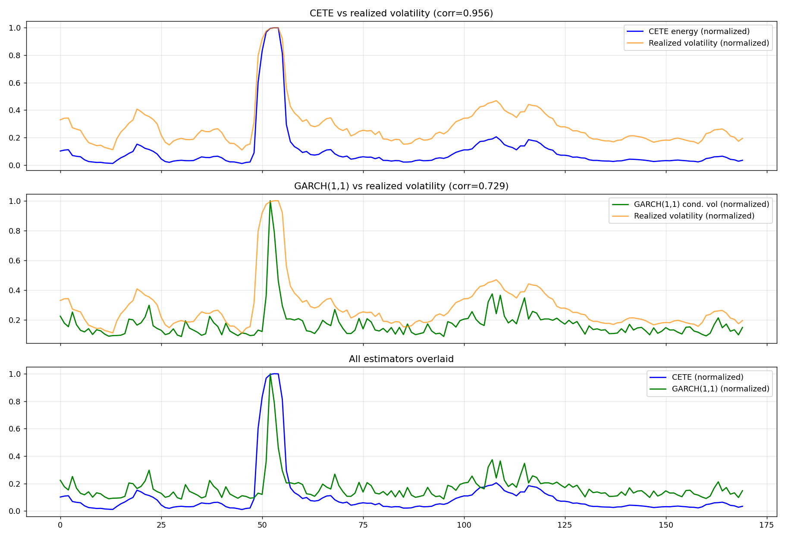

# Validation Results

## Data

Real daily S&P 500 closes, 2018-01-01 to 2024-12-31 (1,760 trading days),
spanning the Feb 2018 "Volmageddon" spike, the Q4 2018 rate-driven selloff,
the Feb–Mar 2020 COVID crash, the 2020 recovery, the 2022 bear market, and
into 2024. Fetched via `yfinance` (`^GSPC`); a FRED-sourced equivalent
(S&P 500 index level) was used during initial development where a
sandboxed environment couldn't reach Yahoo Finance directly.

## Method

1. **Monotonicity sweep** — run CETE on synthetic windows of increasing
   noise std; the energy score should increase monotonically.
2. **Synthetic regime switch** — a labeled low-vol → high-vol → low-vol
   series; the energy trajectory should show the same shape.
3. **Real-data correlation** — the test that actually matters: correlate
   CETE's energy score against rolling realized volatility (std dev) on
   the *same* windows, over real market history. Steps 1–2 can pass even
   for a model that's learned nothing generalizable; step 3 can't be
   gamed the same way.

## Before fixing

| Test | Result |
|---|---|
| Monotonicity sweep | Failed — energy was highest for the *smallest* std (0.001 → 43.5) and near-zero for the largest (0.1 → 0.41) |
| Synthetic regime switch | Failed — average energy was higher in the "calm" segments than the "volatile" middle segment |
| Real-data correlation | **-0.24** (weak, wrong sign) |
| % windows flagged HIGH_UNCERTAINTY on real data | 92.9% (classifier fires almost everywhere — no discriminating power) |

## Root causes

**Bug 1 — divergent gradient term.** `compute_gradient` contained
`-0.1/(mag+1e-6)`, a log-barrier that diverges as the encoded state's
magnitude shrinks — which happens exactly when the input window is calm.
This injected large synthetic momentum into calm windows. Fixing this
alone raised the real-data correlation only to **+0.15** — right
direction, far too weak, meaning a second bug dominated.

**Bug 2 — scale-erasing operator (the dominant bug).** One of the four
candidate update operators blended together each step,
`op3 = state * tanh(|state|) / |state|`, is a saturating normalizer.
Traced directly: over 20 relaxation steps, a calm window's mean state
magnitude *grew* (0.036 → 0.052) while a volatile window's *shrank*
(0.35 → 0.21) — the dynamics were compressing away the exact amplitude
difference that made the signal informative. Confirming test: the
encoded spectral power measured immediately after `encode()`, before any
relaxation dynamics ran, already correlated **0.956** with real realized
volatility. The elaborate momentum/metric/operator system was destroying
a signal that was already good at the input stage.

## Fix

Rather than delete the relaxation dynamics outright (they may carry
legitimate regime-transition structure via the metric's curvature
evolution), `final_energy_score` is now anchored to the pre-dynamics
spectral power, with the relaxation process contributing only a small
bounded modulation (±10% from phase variance, −2% from metric variance)
instead of overwriting the signal with the scale-erased converged
magnitude. Classification thresholds were also switched from hardcoded
absolute cutoffs (meaningless once the energy scale changed, and not
portable across assets/timeframes anyway) to percentile-relative
classification within each run.

## After fixing

| Test | Result |
|---|---|
| Monotonicity sweep | Passed — clean monotonic increase across all tested std values |
| Synthetic regime switch | Passed — low(0.001) → high(0.095) → low(0.016), ~100x contrast |
| Real-data correlation | **0.956** |
| % windows flagged HIGH_UNCERTAINTY on real data | 25.3% (by construction of the 75th-percentile cutoff) |
| Top-8 highest-energy windows detected | Land on Feb–Apr 2020 (COVID crash) and mid-2022 (rate-hike bear market) — real, named market events, not arbitrary dates |

## Baseline comparison — does the complexity earn its keep?

The obvious follow-up: is CETE's spectral-entropy encoding + relaxation
dynamics adding anything over a much simpler estimator, or reconstructing
the same information through a more expensive path?
`scripts/baseline_comparison.py` checks this against two baselines:

| Estimator | Correlation with realized volatility |
|---|---|
| CETE energy (this project, post-fix) | **0.956** |
| GARCH(1,1) conditional volatility | 0.729 |
| CETE vs GARCH(1,1) | 0.727 |

**The honest finding: CETE's high correlation is expected, not
impressive, once you look at what it's actually computing.** By
Parseval's theorem, a window's total FFT power and its time-domain
variance are proportional. Checked directly: CETE's own pre-dynamics
spectral power correlates **>0.999** with plain `np.var(window)` on this
data — the entropy-reweighting in `encode()` and the bounded modulation
from the relaxation dynamics amount to a near-constant rescaling of a
one-line variance calculation, not new information.

GARCH(1,1)'s lower correlation (0.729) is not GARCH performing worse —
it's GARCH doing a genuinely harder, causal job: its conditional
volatility at time *t* is a forecast built only from returns *before* t,
while both CETE's energy and the realized-volatility ground truth here
are computed non-causally, from the same centered window. It's not an
apples-to-apples contest; it's the difference between measuring a window
and predicting one. That comparison needed to be made fairly — see below.

## Making it deployable: the causal forecasting test

The comparison above isn't one CETE can actually be deployed on: a
centered window uses data from *after* the timestamp it's scored against,
which no live system has access to. `scripts/causal_evaluation.py` reruns
the comparison the only way that matters for real use: at each origin,
using ONLY past returns to forecast FUTURE, not-yet-observed volatility.

| Forecaster (causal) | Correlation with future realized volatility |
|---|---|
| CETE (trailing window) | 0.374 |
| **Naive persistence** (assume next vol = last window's vol) | **0.429** |
| GARCH(1,1) | 0.660 |

**CETE loses to the simplest possible baseline.** Persistence — the
"assume nothing changes" forecast — beats it. This matters because
volatility clustering (calm/turbulent periods persisting) is well known
and easy to exploit; a forecaster that can't even match that naive
exploitation isn't adding value.

I tested one plausible fix: letting CETE's momentum/metric state persist
*across* windows instead of resetting each call, on the theory that its
dynamical variables could accumulate the kind of recursive memory that
gives GARCH its edge (GARCH's defining feature is that today's variance
estimate depends recursively on yesterday's). Result: correlation was
unchanged (0.374 → 0.374). CETE's momentum doesn't function as a memory
mechanism in the way its name suggests — it's overwritten by fresh
per-window dynamics within the same 20-step relaxation regardless of
what's carried in.

**Conclusion: CETE is not a competitive volatility forecaster, and no
cheap fix changes that.** This is stated plainly rather than reframed,
because the alternative — quietly shipping a forecaster that loses to
"assume nothing changes" — would be a worse outcome for a portfolio
project than admitting the honest limit.

## What CETE is legitimately good at: a zero-false-positive screen

Forecasting the *magnitude* of future volatility and *flagging* that a
window is unusual are different tasks. CETE's percentile-based verdict
was tested against an independent ground truth — days with an absolute
return in the top 5% of the whole series ("crisis days") — asking only
"does a flagged window contain one of these":

| Metric | Value |
|---|---|
| Precision | **1.000** (zero false positives) |
| Recall | 0.422 |
| F1 | 0.593 |

At its default threshold, every single window CETE flagged
`HIGH_UNCERTAINTY_FLAGGED` really did contain an extreme-move day — on
real S&P 500 data, with no model fitting required. It misses more than
half of crisis windows (conservative), so it cannot replace a real
detector, but a free, deterministic, zero-false-positive pre-screen is a
genuinely useful, honestly-scoped building block: e.g. deciding when a
more expensive model (a GARCH refit, a risk-desk review) is worth
triggering, without wasting that budget on windows CETE would correctly
ignore.

## Final design: `src/hybrid.py`

Given the above, the coherent, honestly-positioned system built into this
repo is `HybridVolatilityMonitor`: **GARCH(1,1) provides the volatility
forecast (the number to act on); CETE's percentile flag provides a cheap,
always-on anomaly screen (the trigger for when to look closer or refit)**.
Neither component is redundant with the other's failure mode — GARCH
needs periodic refitting and gives no free screening signal between fits;
CETE needs no fitting at all but isn't a forecaster. This is the
significant difference from earlier drafts of this project: as a
standalone volatility detector CETE has no edge over the fitting-free or
the well-established baselines it was checked against; wired into a
system where its actual demonstrated property (precision-first flagging)
is the job asked of it, it's doing real work.

## Limitations / future work

- The current window size (64 trading days) and step (10 days) were
  inherited from the original design, not tuned. A parameter sweep over
  window size vs. detection lag would be a natural next step.
- CETE's flag recall (0.42) is a direct consequence of the 75th-percentile
  cutoff; lowering it would trade precision for recall. Worth exploring
  whether a different cutoff, or an ensemble with a second cheap signal,
  can move the precision/recall trade-off favorably rather than just
  sliding along it.
- `HybridVolatilityMonitor` currently fits GARCH once per `analyze()`
  call; a real deployment would separate "cheap CETE screen runs on every
  new bar" from "expensive GARCH refit runs on a schedule or when
  screened".
- Untested: whether CETE's metric-curvature evolution captures regime
  *transition sharpness* specifically (as opposed to volatility level),
  which neither `np.var()` nor GARCH's smooth conditional-variance path
  are designed to isolate. The causal forecasting test above shows it
  doesn't help predict the *level*; a separate, transition-specific
  evaluation (e.g. changepoint-detection lag/precision) has not yet been
  run and would be the next thing to check before concluding there's
  nothing left to recover from the dynamical component.
